# The Finite Element Method for Option Pricing under Heston’s Model

## Abstration

Option is one of the most important derivatives in financial markets. Since for some complicated types of options there are no available analytical solutions, we are devoted to applying Finite Element Method (FEM) for option pricing problem in this report. First, we try to resolve the problem of plain vanilla option pricing with analysis of accuracy of FEM by comparing with the analytical solution. Further, in order to demonstrate advantages of the FEM, we take a deeper analysis and derive some equations under [Heston’s model](https://en.wikipedia.org/wiki/Heston_model), which pushes forward the PDE formulation of the model into two- dimensional problem. Finally, we provide a set of examples for pricing European type option under Heston’s model, and associated numerical results to demonstrate the accuracy, convergence and efficiency.

## Classic [Black-Shcoles Model](https://en.wikipedia.org/wiki/Black%E2%80%93Scholes_model)

* For the **European call**, **European put** and **American put** option, please run `1D_BS/European_Call/ECmain.m`,`1D_BS/European_Put/EPmain.m` and `1D_BS/American_Put/APmain.m` respectively. 
* If you want to change the parameters, please take a modification in the file `SetOpPara.m` in every folder.

### 1D European Call

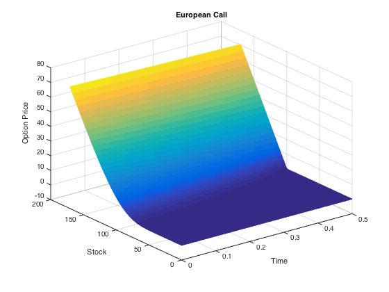
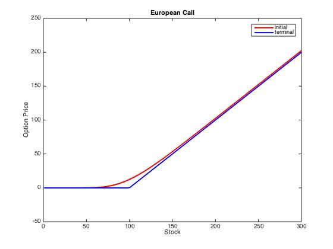
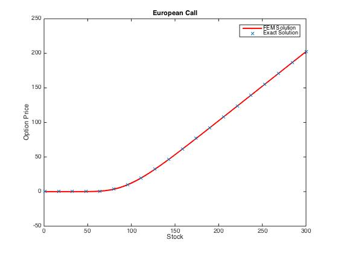

### 1D European Put

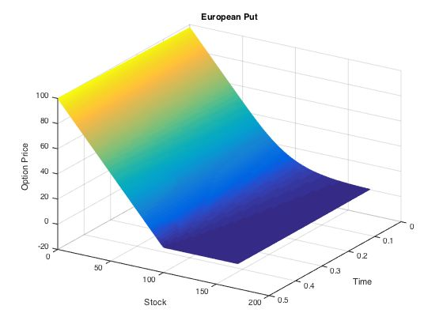
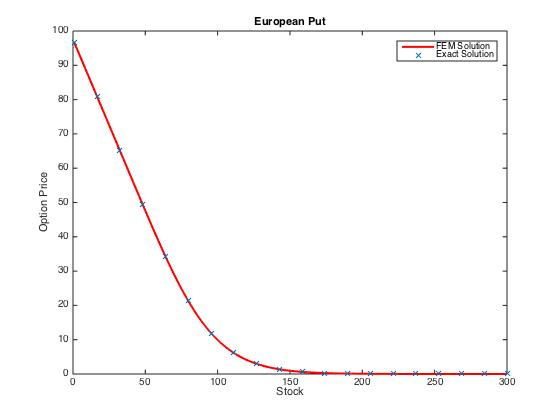
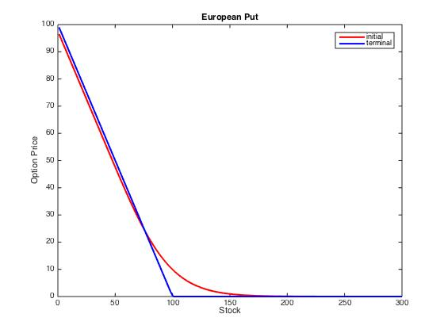

### 1D American Put

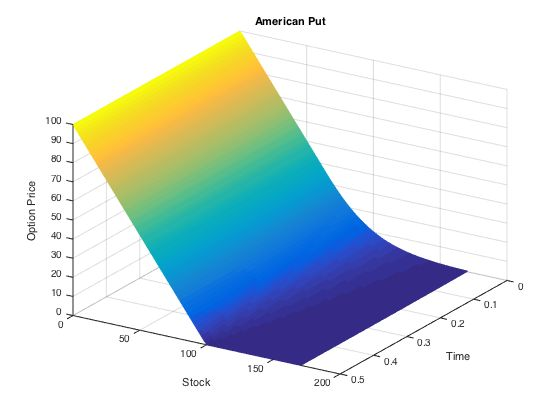
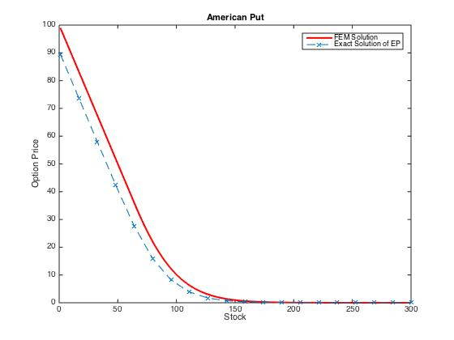
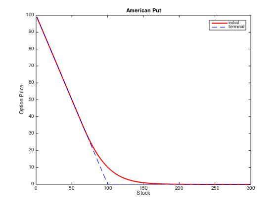

## [Heston's Model](https://en.wikipedia.org/wiki/Heston_model)

### 2D European Call 

* Directly run the file `2D_Heston/2D_European_Call/main_Call.m`. One mesh plot and solution of European price will be generated. Adjust the parameter in `2D_Heston/2D_European_Call/main_Call.m`;
* `2D_Heston/2D_European_Call/Solve.m` and `2D_Heston/2D_European_Call/plot_option.m` files are two function;
* Waiting bars will show the phase of accomplishment of program;
* When programs are done, a alerting sound will ring;

### 2D European Put

* Directly run the file `2D_Heston/2D_European_Put/main_Put.m`. One mesh plot and solution of European price will be generated.Adjust the parameter in `2D_Heston/2D_European_Put/main_Put.m`;
* Waiting bars will show the phase of accomplishment of program;
* When programs are done, an alerting sound will ring;

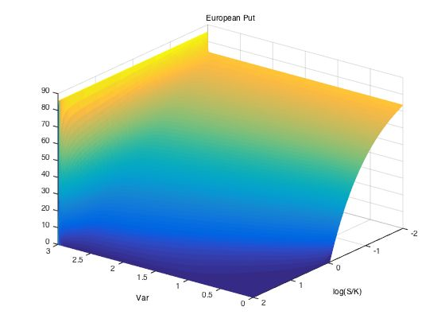
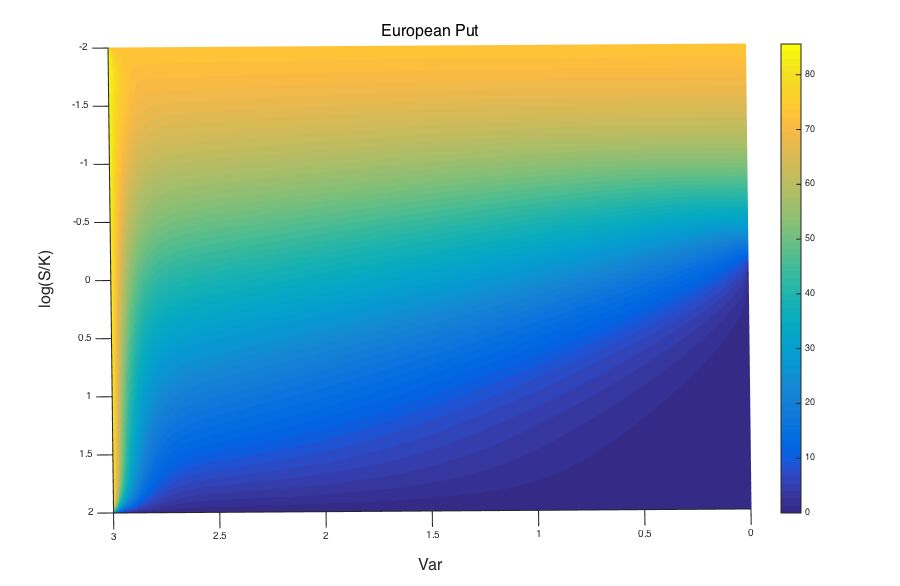

### Mesh and Basis

* Please directly run file `2D_Heston/Mesh_and_Basis/mesh.m` to get the mesh of spatial resolution of (5,6) with label of triangles and nodes;
* Run file `2D_Heston/Mesh_and_Basis/reference_tri_plot.m` to get the plots of three reference triangles with labels;

**Note**: Details can be found in [`Report.pdf`](https://github.com/vincent27hugh/FEM_Heston_Model/blob/master/Report.pdf)
**Note**: This is the code for the final project of MA6621, CityU.
